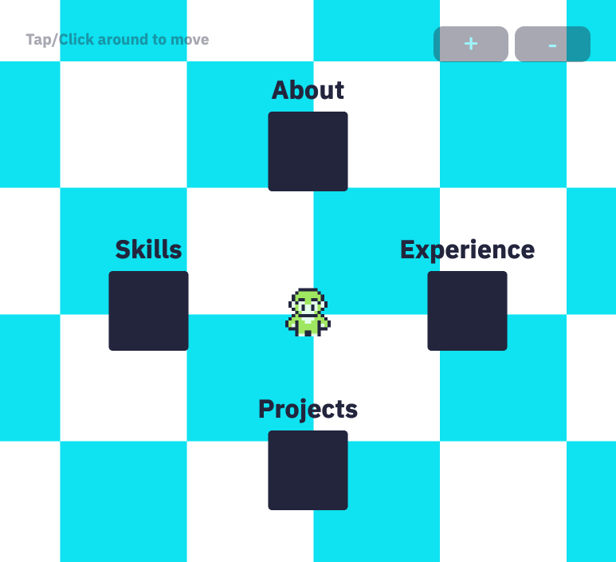

# Portfolio Website



This is a personal portfolio website built using **React** and **Vite**, showcasing my projects, skills, and experience as a developer. The website is optimized for performance and features smooth animations powered by **Kaplay**.

## Features

- **Responsive Design**: The site is fully responsive, adapting to various screen sizes.
- **Project Showcases**: A section to display and highlight past projects with descriptions and links.
- **Contact Form**: A functional form for visitors to get in touch.
- **Smooth Animations**: Interactive animations powered by **Kaplay**.
- **Fast Development**: Powered by **Vite**, providing fast reloads and a streamlined development experience.

## Technologies Used

- **React**: A JavaScript library for building user interfaces.
- **Vite**: A fast, opinionated build tool that makes use of modern JavaScript features.
- **Kaplay**: A powerful animation library for smooth, interactive web experiences.
- **Jotai**: A minimal state management solution for React applications.
- **ESLint**: Ensures code quality and consistency with linting.

## Installation

To run the project locally, follow these steps:

1. **Clone the repository**:

   ```bash
   git clone https://github.com/your-username/portfolio-site.git
   ```

2. **Navigate to the project directory**:

   ```bash
   cd portfolio-site
   ```

3. **Install dependencies**:

   ```bash
   npm install
   ```

4. **Start the development server**:

   ```bash
   npm run dev
   ```

## Learning Resources

- **JSLegend**: This project was built following a tutorial by JSLegend. You can find the tutorial [here](https://www.youtube.com/watch?v=OejpBl2s9OY).
